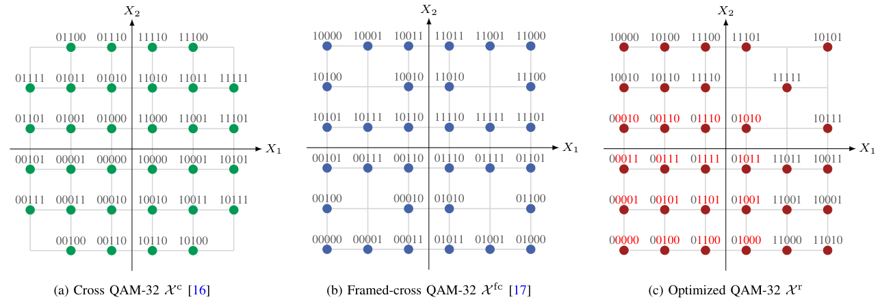
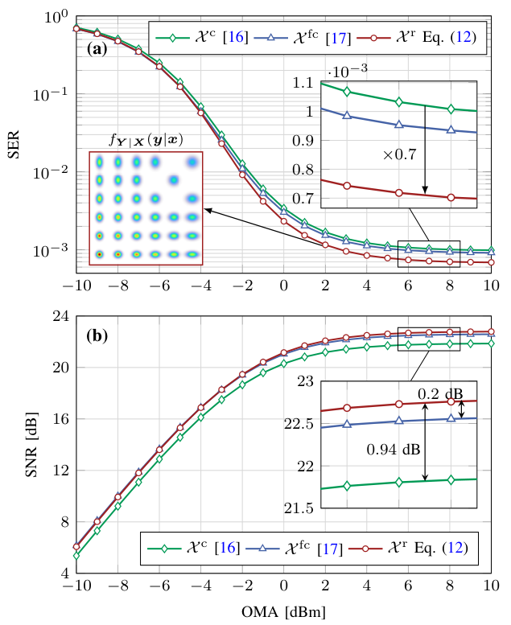
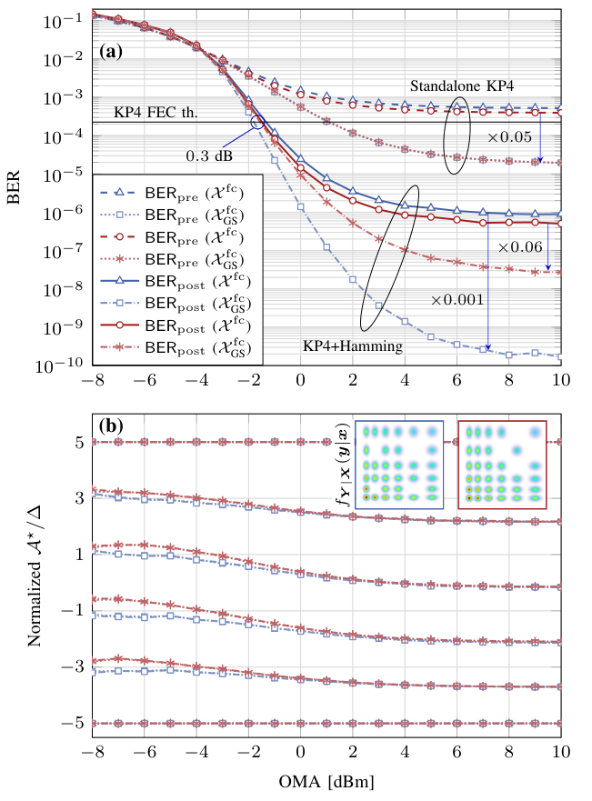

# On PAM-6 Constellation Design for Next-generation IM-DD Systems with Laser RIN

Simulations for PAM-6 constellation design in next-gen intensity-modulation (IM) and direct-detection (DD) systems with laser relative intensity noise (RIN). These scripts are the backbone to generate the results in [\[1\]](#1), [\[2\]](#2), and [\[3\]](#3).

The repository performs simulations for the following scenarios:
1. Find the constellation that minimizes the symbol error rate (SER) in a RIN-dominated scenario.
2. Calculate the metrics signal-to-noise ratio (SNR), SER, and bit error rate (BER) for specific constellations.
3. Calculate the Post-forward error correction (FEC) BER using a (128, 120) extended Hamming code with soft decision decoding [\[4\]](#4).
4. Geometric shaping via minimizing the Pre-FEC BER of the constellations.
5. Calculate the Post-FEC BER of the geometrically-shaped constellations.

## Directory structure
- `src`: contains `*.mat` files required to run the scripts.
- `functions`: contains `MATLAB` functions required to run the scripts.
- `examples:` contains the scripts to simulate the previously numbered scenarios.

## Usage
1. Download or clone the repository
2. Set the current directory in `MATLAB` to the `examples` folder
3. Setup the simulation, data rates, and fiber parameters within the first segment of a script (Optional)
4. Run the desired script

Note that examples 2-to-5 heavily rely on Monte Carlo simulations. The scripts use GPU by default, which requires a CUDA-compatible GPU.

To speed-up simulations (or refine precision) you can tweak the following Monte Carlo simulation parameters:
- `Nsym`: number of PAM symbols to simulate
- `N_codewords`: number of Hamming codewords
- `N_MC`: number of Monte Carlo iterations per optical modulation amplitude value (OMA) 

## Output Examples
Here are some examples of the results achieved with these scripts (figures are taken from [\[3\]](#3)):
- **Example 2**

- **Example 5**

## References

<a name="1">\[1\]</a>
F. Villenas, K. Wu, Y. C. Gültekin, J. Riani, and A. Alvarado,
"On geometric shaping for 400 Gbps IM-DD links with laser intensity noise,"
in *Optical Fiber Communications Conference (OFC)*,
San Francisco, USA,
Apr. 2025.
DOI: [10.1364/OFC.2025.Th1K.8](https://doi.org/10.1364/OFC.2025.Th1K.8)

<a name="2">\[2\]</a>
F. Villenas, K. Wu, Y. C. Gültekin, J. Riani, and A. Alvarado,
"A new 5-bit/2D-symbol modulation format for relative intensity noise-dominated IM-DD systems,"
in *European Conference on Optical Communications (ECOC)*,
Copenhagen, Denmark,
Sep. 2025.
DOI: [10.1109/ECOC66593.2025.11263056](https://doi.org/10.1109/ECOC66593.2025.11263056)

<a name="3">\[3\]</a>
F. Villenas, Y. C. Gültekin, and A. Alvarado,
"On PAM-6 constellation design for next-generation IM-DD systems with laser RIN,"
in *Journal of Selected Topics in Quantum Electronics*,
Jan/Feb. 2027, 
(To be published)

<a name="4">\[4\]</a>
B. Welch, J. Ingham, E. Bernier, and P. Dawe,
"Baseline proposals for 200G/L PMD specifications for single wavelength 500 m and 2 km standards,"
*IEEE P802.3dj Ethernet Task Force*,
Feb. 2023,
URL: [welch_3dj_03_2309](https://grouper.ieee.org/groups/802/3/dj/public/23_09/welch_3dj_03_2309.pdf) 
